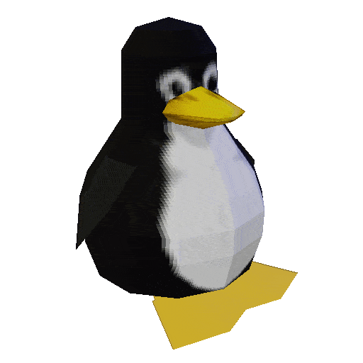

# Projects
## asdf

list:

- first
- second
- third

numbered list:

1. first
2. second
3. third

the function `printf()` is cool

Test paragraph, **bold**, *italic*

> quote

```cpp
int main()
{
    return 0;
}
```

html:

```html
<p1>
    <b>foo</b>
</p1>
```

go:

```go
package main

import (
    "fmt"
)

func main() {
    fmt.Printf("Hello world, %d\n", 42)
}
```

python:

```python
print("-".join([y*y for y in [
    int(x.strip()) for x in open("input.txt").readlines()]
]))
```

plain text:

```plaintext
Sit earum magni ipsam tempora voluptas ducimus Enim in cum nisi magnam quibusdam Officia cum consectetur
dicta sapiente animi quibusdam? Rerum eveniet possimus alias debitis enim. Eius esse expedita voluptas
```

bash:

```bash
echo input.txt | grep "\<# [a-z]+.?" > output.txt
```

markdown:

```markdown
list

- first
- second
- third

the function `printf()` is cool

Test paragraph, **bold**, *italic*

> quote

```

assembly:

```x86asm
section .text

    xor eax, eax

    mov ebx, 12
    xor rsi, rsi

loop:
    mov [rsi], ebx
    inc rsi
    add ebx, 2

    cmp ebx, 34
    jne loop
```

here is an image



